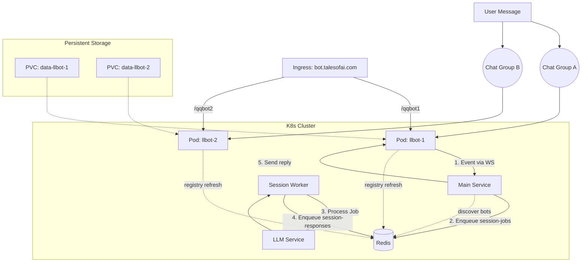

# ADR-003: 分布式多账号 Bot 架构设计 (Multi-Bot Architecture)

## 1. 背景 (Context)

为了应对业务增长和风控需求，Bot Agent 系统需要从单实例单账号模式扩展为能够同时管理 10 个以上 QQ/Discord 账号的分布式集群。

**主要痛点与需求：**

1.  **账号扩展**：现有架构仅支持单实例登录一个账号。需要支持 10+ 个账号同时在线。
2.  **会话连续性**：在账号切换或服务重启时，需要继承历史会话记录，避免上下文丢失。
3.  **群归属与路由**：每个群组只允许一个 Bot 负责处理，但允许一个 Bot 同时服务多个群。系统需要确保群消息只由其归属 Bot 处理并回执。
4.  **WebUI 访问**：每个 Bot 都有独立的扫码登录/管理界面，需要通过统一的域名访问（如 `bot.talesofai.com/qqbot1`），且要求 IP 固定+数据持久化以防反复扫码。
5.  **K8s 部署**：基于 Kubernetes 环境部署，要求尽量利用原生特性。

## 2. 决策 (Decision)

我们决定采用 **"StatefulSet + 群归属路由 + Redis 注册发现"** 的架构方案。

### 2.1 部署架构：StatefulSet + 主服务集中连接

放弃传统的 Deployment，改用 Kubernetes **StatefulSet**。

- **多实例管理**：设置 `replicas: N`，实际使用 `llbot-1` ~ `llbot-N`。
- **Pod 标识**：K8s 自动分配固定的 Pod 名称（`llbot-1`, `llbot-2`...），便于管理和 DNS 寻址。
- **数据持久化 (PVC)**：使用 `volumeClaimTemplates` 为每个 Pod 自动申请独立的 PVC 存储（基于 `alibabacloud-cnfs-nas`）。
  - 挂载路径：`/app/data`。
  - **优势**：Bot 重启或漂移后，`device.json` 和 `session.token` 等登录凭证依然存在，**无需重新扫码**。
- **主服务分离**：
  - `llbot` Pod 仅运行 QQ Client（Milky/Lagrange）。
  - 主服务独立部署，通过 K8s Service 直连所有 `llbot` 的 WS 入口。
  - Pod 内额外运行轻量注册器，向 Redis 上报 `botId -> wsUrl`。

### 2.2 Bot 发现：Redis 注册表 (Redis Registry)

为避免手工维护 Bot 列表，主服务通过 Redis 注册表自动发现可用 Bot。

- **注册键**：
  - `llbot:registry:{botId}` -> `{ wsUrl, platform, lastSeenAt }`。
  - 使用 TTL（如 30 秒）保证自动剔除失联实例。
- **注册方式**：
  - 每个 `llbot` Pod 内运行轻量注册器，读取 `self_id` 并定期刷新注册信息。
  - 本地部署同样注册到 Redis，避免依赖 K8s API。
- **主服务发现**：
  - 启动时扫描现有注册表并建立连接池。
  - 订阅变更（Pub/Sub 或 Keyspace Notification）以动态增删连接。

### 2.3 核心机制：触发路由 (Trigger Routing)

多 Bot 允许同时在线，同一群组内允许多 Bot 同时回复。路由规则改为基于触发条件而非群归属。

- **@ 触发**：仅被 @ 的 Bot 回复。
- **关键词触发**：全局/群关键词由群内所有 Bot 回复；机器人关键词仅对应 Bot 回复（无抢锁）。
- **复读触发**：群内所有 Bot 均可进入复读逻辑（无抢锁）。
- **消息摘要**：
  - `contentHash` 包含图片、附件、富文本等内容，用于会话记录与追踪，不作为去重键。
- **关键词来源**：
  - 全局关键词：`/data/router/global.yaml`。
  - 群关键词：`/data/groups/{group_id}/config.yaml`。
  - 机器人关键词：`/data/bots/{bot_id}/config.yaml`。

### 2.4 消息路由：归属一致性 (Ownership-Consistent Responses)

每个 Bot 负责自己收到的消息并发送回执，主服务按 `botId=self_id` 回路发送。

- **一致性原则**：谁收到消息谁回复，避免跨 Bot 回复导致的群不可达问题。
- **回复路由**：Worker 写入 `session-responses` 时携带 `selfId`，主服务根据连接池将回复下发到对应 Bot。

### 2.5 外部访问：Ingress 路径映射

为了满足 `bot.talesofai.com/qqbot1` -> `llbot-1` 的访问需求。

- **Ingress 配置**：
  - 创建 10 条路径规则（Path Rule）。
  - Path `/qqbot1` 转发给 Service `llbot-1` (指向 Pod `llbot-1`)。
  - Path `/qqbotN` 转发给 Service `llbot-N`。
- **Service 设计**：
  - 创建 10 个 Headless Service 或普通 Service，分别通过 `statefulset.kubernetes.io/pod-name: llbot-N` 标签选择器精确指向特定 Pod。
  - 虽然配置稍显繁琐，但提供了最精确的控制和符合人类直觉的 URL 映射（1对1）。

## 3. 详细设计图 (Architecture Diagram)

## 4. 后果与权衡 (Consequences)

**优势 (Pros)：**

1.  **高可用与数据安全**：StatefulSet + PVC 确保了即使 Pod 崩溃，账号登录态也不丢失，极大降低了风控风险。
2.  **多 Bot 并发**：@ 与关键词触发规则清晰，允许群内多 Bot 同时回复。
3.  **自动发现**：通过 Redis 注册表自动感知 Bot 上线/下线，无需手工维护列表。
4.  **精确路由**：Web 请求和消息回复都能精确路由到指定的 Bot 实例。
5.  **易于扩容**：只需修改 StatefulSet 的 `replicas` 数量即可增加新 Bot。

**劣势 (Cons)：**

1.  **资源开销**：每个 Bot 都是一个独立的 Pod（包含 Node.js 运行时 + QQ 客户端），10 个 Bot 需要较多的内存和 CPU 资源。
2.  **配置复杂度**：Ingress 和 Service 需要配置 10 组规则（虽然可以通过 Helm 模板简化，但原生 YAML 较长）。
3.  **并发回复**：关键词/复读会导致同群多 Bot 同时回复。
4.  **注册依赖**：注册器或心跳异常会导致 Bot 被误判离线。

## 5. 实施计划 (Implementation Steps)

1.  **代码层**：
    - [ ] 入口层：实现 @/关键词/复读触发路由规则（无抢锁）。
    - [ ] 连接池：实现 Redis 注册发现（扫描 + 订阅）并维护多 Bot 连接。
    - [ ] 消息模型：明确 `contentHash` 覆盖图片/附件/富文本。
    - [ ] `config.ts`: 适配 K8s 环境变量（包括 Redis 注册表前缀与 TTL）。

2.  **部署层**：
    - [ ] `llbot-statefulset.yaml`: 定义 Replicas=N, VolumeClaimTemplates。
    - [ ] `llbot-services.yaml`: 定义 N 个独立 Service。
    - [ ] `llbot-ingress.yaml`: 定义 N 条 Ingress Rule。
    - [ ] `llbot-registrar.yaml`: 在每个 Pod 内注册 `botId -> wsUrl` 到 Redis。

3.  **验证**：
    - 部署后，访问 `bot.talesofai.com/qqbot1` 确认进入 Bot 1 的 WebUI。
    - 在群内发送消息，确认只由该群归属的 Bot 回复。
    - 重启 Pod，确认无需重新扫码。
